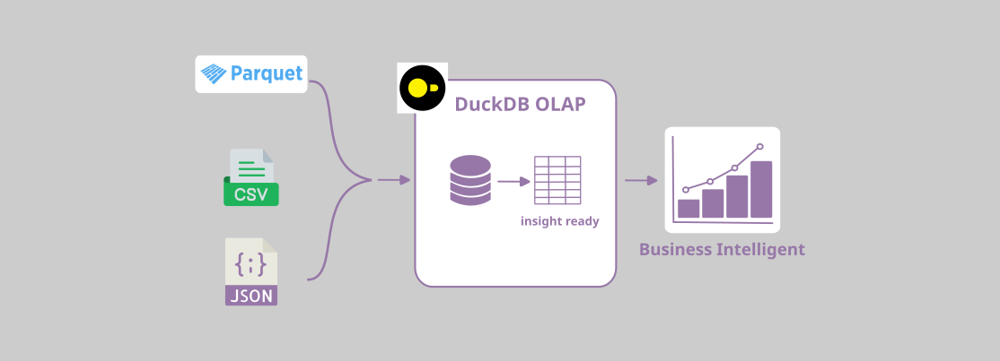

# high-performance-OLAP-duckdb
it's an embedded database that runs within your application or process, but it is specifically optimized for complex analytical queries on large datasets.

# *Project Overview*
This project showcases high-performance Online Analytical Processing (OLAP) using DuckDB. DuckDB is an embedded analytical database optimized for running complex SQL queries directly within an application or process, particularly on large datasets stored in formats like Parquet. The demonstration involves performing key business analysis, such as calculating customer revenue and order counts.
# *Problem To Be Solved*
* The project addresses the challenge of running complex, high-speed analytical queries directly within an application or process. 
* It solves the issue of slow query performance often encountered when using traditional transactional (OLTP) databases for analytical workloads or the overhead associated with setting up and maintaining separate, large-scale data warehousing infrastructure.
# *Business Impact*
* Enables near real-time business intelligence (BI) and reporting by providing highly efficient query execution for complex calculations (like aggregating customer revenue).
* Allows decision-makers to quickly retrieve timely insights into customer behavior, sales performance, and revenue generation, facilitating faster, more data-driven actions.
# *Business Leverage*
* Cost Efficiency: By using DuckDB as an embedded database, it eliminates the need for expensive, dedicated analytical servers or clusters, reducing infrastructure and maintenance costs.
* Application Performance: It allows for the direct integration of high-speed analytics into applications, reports, or dashboards, drastically improving the responsiveness and user experience.
* Scalability for Analytics: Leveraging DuckDB's column-oriented and vectorized execution engine ensures that performance remains high even as the underlying datasets grow larger.
# *Project Flow*
1. Create tables from parquet files
   ```sql
   -- Data Ingestions --
   -- 1. customer table view
   CREATE OR REPLACE TABLE customers AS
   SELECT *
   FROM read_parquet('/home/mulyo/Learning/duckdb/parquet/customer_data.parquet');

   -- 2. order table view
   CREATE OR REPLACE TABLE orders AS
   SELECT *
   FROM read_parquet('/home/mulyo/Learning/duckdb/parquet/order_data.parquet');

   -- 3. order_item table view
   CREATE OR REPLACE TABLE order_item AS
   SELECT *
   FROM read_parquet('/home/mulyo/Learning/duckdb/parquet/order_item_data.parquet');
   ```
3. Create CTE 'customerrevenue'
   ```sql
   WITH customerrevenue AS(
   SELECT 
       c.customer_id,
       c.full_name AS customername,
       COUNT(DISTINCT o.order_id) AS ordercount,
       SUM(oi.item_quantity * oi.item_unit_price) AS revenue
   FROM
       customers c
   JOIN orders o ON c.customer_id = o.customer_id
   JOIN order_item oi ON o.order_id = oi.order_id
   GROUP BY 
       c.customer_id,
       c.full_name
   ORDER BY
       ordercount,
       revenue
       DESC)
   ```
5. Dispaly dataset ready
   ```sql
   SELECT 
     customer_id, 
     customername, 
     ordercount, 
     revenue
   FROM 
     customerrevenue
      LIMIT 10;
   ```
   ```bash
   ❯ duckdb < customerrevenue.sql
   ┌─────────────┬───────────────────┬────────────┬───────────────────┐
   │ customer_id │   customername    │ ordercount │      revenue      │
   │    int64    │      varchar      │   int64    │      double       │
   ├─────────────┼───────────────────┼────────────┼───────────────────┤
   │       11031 │ Alexander Palmer  │          3 │            583.19 │
   │       11011 │ Chelsey Lopez     │          3 │ 528.6500000000001 │
   │       11091 │ Denise Ryan       │          4 │            835.24 │
   │       11041 │ Kenneth Palmer    │          4 │ 718.4499999999999 │
   │       11083 │ Gabriel Lee       │          4 │            689.97 │
   │       11071 │ Dylan Stone       │          5 │           1036.56 │
   │       11079 │ Larry Thomas      │          5 │ 968.8600000000001 │
   │       11040 │ Andrew Tapia      │          5 │ 943.8900000000001 │
   │       11043 │ Teresa Moore      │          5 │ 500.8499999999999 │
   │       11068 │ Melissa Wilson MD │          5 │            493.47 │
   ├─────────────┴───────────────────┴────────────┴───────────────────┤
   │ 10 rows                                                4 columns │
   └──────────────────────────────────────────────────────────────────┘
   ```
# *Assumption* 
* duckdb installed on system, suggested on virtual environment
  ```bash
  python3 -m venv duck_env
  cd duck_env
  source bin/activate
  (env) curl https://install.duckdb.org | sh
  (env) duckdb --version
   v1.3.2 (Ossivalis) 0b83e5d2f6
  ```
* text editor, (suggested) Vim
  ```bash
  sudo apt install vim --break-system-packages --user
  ❯ vim --version
   NVIM v0.9.5
   Build type: Release
   LuaJIT 2.1.1703358377

   system vimrc file: "$VIM/sysinit.vim"
     fall-back for $VIM: "/usr/share/nvim"

   Run :checkhealth for more info
  ```
